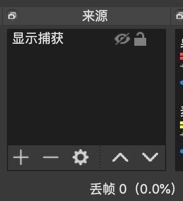
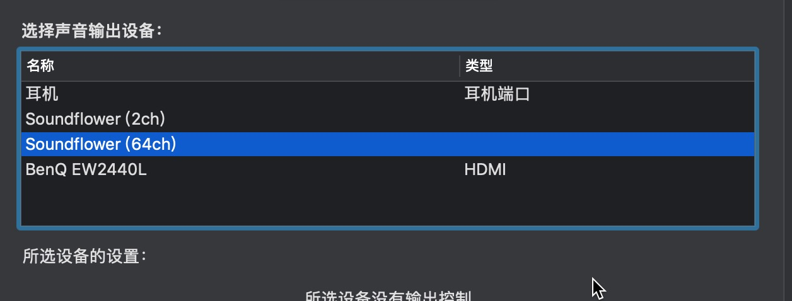

之前由于给 B 站交了身份证，因此就想稍微利用一下，直播写一下代码；

不过 macOS 没有 B 站的一键开播客户端，这里来介绍一下我的折腾成果。

<!-- more -->

## 1. 前期准备

1. 实名认证（手持身份证）的 B 站账户
2. OBS（录屏）
3. Soundflower（录制桌面声音）
4. 弹幕库（弹幕管理）

## 2. 安装

OBS 和 Soundflower 都可以使用 `brew` 安装

```sh
brew cask install obs
brew cask install soundflower
```

弹幕库在其[官网](http://bilibili.danmaku.live)安装

## 3. 配置来源捕获

现在 OBS 安装之后已经有一个配置向导了，跟着配置向导走就可以配置完成。

随后在来源中建立一个捕获，如图所示：



这里建立的是显示捕获，也就是将一个显示屏的图像全部捕获

在上方的区域会显示当前捕获的内容。

除了显示捕获之外，还可以创建窗口捕获，同时上方区域可以调整各个来源图像的大小，可以捕获多个来源并将它们统一显示到上方区域。

上方的显示区域就是你最终直播出去的图像了。

## 4. 捕捉桌面音频

通常来说，我们直播的同时也希望让观众能听到我们电脑里面播放的音乐，有时候还需要设置自动点歌功能；

但是，OBS 在 macOS 下不能捕捉桌面音频，需要一些其他的软件进行这个工作。

macOS 下的桌面音频捕捉工具有很多，但是大部分不是收费的就是配置比较复杂，经过一番对比之后，决定使用 [Soundflower](https://github.com/mattingalls/Soundflower) 进行音频捕捉。

安装它之后，会多出两个声音输出设备，如图所示：



同时，OBS 中的音频配置选项中的桌面音频也终于可以配置了。

将 mac 的声音输出设备如上图选择，然后在 OBS 的桌面音频中选择相同的输出，即可将桌面音频进行推流。

到这里，我们会发现 mac 很意料之中的没有了声音，听众能听到声音，但是我们听不到也不行啊；

不过，好在 OBS 的音频具有一个 **监听并输出** 的选项，在音频的高级属性中可以设置；

我们将监听设备设置为能让我们听到声音的输出，如内置的音频输出或者喇叭，然后将对应的音频轨道设置为监听并输出；

这样，我们和观众就都能听到声音了。

## 5. 开始推流

在音频和视频准备完毕，本地测试没有问题之后，我们就可以开始直播了。

首先，打开弹幕库的快速开播，点击开始直播获得 RTMP 地址和密码；

然后在 OBS 的推流选项中选择『自定义推流』，并填入获取到的 RTMP 地址和密码；

最后，在 OBS 主界面的右下角点击『开始推流』，你的直播就开始了！

## 6. 题外话

为了给我们的直播间能有点流量，我们最好给直播间设置一个封面。

不过封面这个东西和 B 站的政策有关，这里来介绍一下目前 (2019.10.01) 的 B 站的封面政策。

B 站的封面分为正方形和长方形两种，其中：

1. 正方形为『颜值封面』，也就是这个封面必须是『**真人的脸**』，注意不要把不是真人脸的图传到这里面去
2. 长方形为普通封面，也就是可以上传普通的图片，但是也不是什么图都行，例如大面积留白，全部都是字的封面就不行

B 站封面是审核制的，通不通过实际上也有一定的运气成分。

最后祝大家直播愉快(?)
