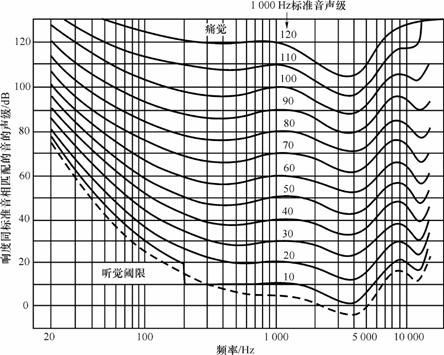

最近准备入门音视频开发，就学习内容做一下笔记吧

<!-- more -->

## 1. 声音的物理相关概念

声音是纵波，是由波源振动产生的，声波在介质中传播，是通过波源振动引起介质分子的周期性振动进行的

### 1.1 声音相关 n 要素解析

- 声波三要素
  1. 频率
  2. 振幅
  3. 波形
- 语音四要素
  1. 音高
  2. 音强
  3. 音长
  4. 音色
- 声音三要素
  1. 音调
  2. 响度
  3. 音色

几要素之间的关系：

```
频率 <-> 音高 = 音调
振幅 <-> 音强 <-> 响度
波形 <-> 音色
```

具体来说，声音的音高就是音调，与声波的频率相关
声音的音强和响度相关，两者和声波的振幅有关
声音的音色与声波的波形相关，但也和其他要素有关

音长是一个音的持续时间长短，在语音学等有研究意义，但不属于声音的物理性质

下面对几个概念进行解析

#### 1.1.1 音调与频率

音调或者音高是衡量人类心理对标准音高的感受，通常使用字母和升降调符号（如 `A#`）来对音高进行标记，和声波的频率相关。

标准音高记为 $A$，其频率为 **440Hz**

事实上，根据不同的标准可以列出频率和音调之间的函数关系，如广为使用的 MIDI 标准规定了一个线性的音高空间，其函数表达式为：

$$
p = 69 + 12\times\log_2 { \left(\frac {f}{440} \right) }
$$

其中，标准音高 $A = 69$

与音调相关的常见概念还有：

1. 音阶：按照音高排列的一系列音符，有多种组合方式，例如常见的 Do-Re-Mi 就是七声音阶
2. 音程：两个音的音高之间的相对关系，在频率上表现为两个音的频率差距，通过调律系统确定，目前最常用的为十二平均律
3. 八度：音程的一种，指的是两个音的频率关系为 **2:1**
4. 半音：采用十二平均律的一种音程划分，一个八度分为十二个半音，半音之间的频率**比值**为： ${\displaystyle \,{\sqrt[{12}]{2}}=2^{\frac {1}{12}}\approx \,} {\displaystyle 1.0594630943593} {\displaystyle 1.0594630943593}$
5. 全音：两个半音的距离为一个全音


#### 1.1.2 音强、声压和响度

音强、声压响度都与声波的振幅相关，都是描述声音能量大小的一个度量，其中：

音强又称声强，是**客观量**，定义为单位面积的声音功率，单位为 $\mathrm{W/m^2}$

声压也是**客观量**，是指声波通过介质时，由振动产生的**压强改变量**，单位为帕斯卡($Pa$)

响度是**主观量**，指的是人类感觉声音大小的知觉量，响度不仅和音强有关，也和**频率**有关

##### 1.1.2.1 音强和声压

音强和声压具有换算关系，设 $I$ 为声强，$p$为声压，$v$为声音在介质中的速度，则：

$$
I = p \cdot v
$$

> 上面的计算式可以通过单位制运算进行验证：
> $$
> \begin{aligned}
> Pa &= N / m^2 \\
> v &= m/s \\
> \therefore I_1 &= \frac{N}{m^2} \cdot \frac{m}{s} \\
> &= \frac{N}{ms} \\
> \because I &= W/m^2 \\
> P &= F \cdot v \\
> &= N \cdot m/s \\
> &= W \\
> \therefore I_2 &= \frac{W}{m^2} \\
> &= \frac{N \cdot m/s}{m^2} \\
> &= \frac{N}{ms} \\
> \because I_1 &= I_2 \\
> \therefore C&orrect
> \end{aligned}
> $$


##### 1.1.2.2 声压和声压级

声压的变化范围很广，因此，通常使用声压级(SPL)对声音的大小进行描述，声压级是以对数尺度衡量有效声压对一个基准值的大小，单位为分贝($\mathrm{dB}$)

声压级基准值：人类对于 **1kHz** 的听阈，即产生听觉的最小压强，为$20\mu\mathrm{Pa}$，也被定义为 0 分贝

声压级换算公式：

$$
L_{p}=20\log _{10}\left({\frac {p_{\mathrm {rms} }}{p_{\mathrm {ref} }}}\right){\mathrm{dB}}
$$

其中，$p_\mathrm{ref}$ 即为声压级基准值

> 分贝，是两个量度相同的单位的**比值的度量**，任何的两个相同单位的量的比值都可以是分贝，因此分贝的使用范围非常广泛，除了在这里的声学领域使用到以外，在通信领域，例如 WIFI 的信号强度也是使用分贝进行度量

##### 1.1.2.3 响度、声压值和频率的关系

响度不仅和声压级相关，同时和频率也有关系，这三者的关系可以制作出一张著名的**等响曲线**



其中，里面的 1kHz 标准音声级即为响度的单位

从图中我们可以看到，曲线在 **3kHz-4kHz** 范围内**最凹**，说明在这个频率范围，达到同样响度所需要的声压级比其他范围要少，即人对 3kHz-4kHz 的声音**更敏感**

##### 1.1.2.3 响度的单位

响度的单位有两个，分别为**方(Phon)** 和 **宋(Sone)**

方是响度的客观度量，定义为 1kHz 下的声压级，称为响度级，如 1kHz 下的 60dB 的声音响度级为 60 方；
方不具备数量之间的关系，两个方的数量的不同仅代表两个声音的大小不同，不能对这两个声音进行量化，如 60 方的声音比 40 方的声音大，但是不能说 60 方的响度大小为 40 方的 1.5 倍，双方不具备这种关系

宋是响度的主观度量，**表示人耳在自然状态下，根据声压级的变化所表现出的对于响度听感的变化**；
宋具有数量关系，2 宋的声音一定比 1 宋的声音大两倍

宋和方之间的关系是非线性的

#### 1.1.3 波形、基波和谐波

声波总是可以分解为不同频率、不同振幅的正弦波的叠加，这种分解过程就称为傅里叶变换；

基波：一个标准的正弦波，称为基波
谐波：比基波的频率高**整数倍**的波被称作谐波

如果一个复合音由基波和它的谐波相叠加构成，那么这个过程就叫做**谐波叠加**

### 1.2 声速、反射与透射

传播声音的介质有很多，如空气、水等，声音在不同介质的传播速度也不同：

1. 空气：$340\mathrm{m/s}$
2. 蒸馏水：$1497\mathrm{m/s}$
3. 铁棒：$5200\mathrm{m/s}$

声音是纵波，遇到阻碍就会发生反射与透射；

反射是声波在遇到阻碍之后，改变传播方向的一种特性
透射则是声波在遇到阻碍之后，穿越阻碍的一种特性

根据这两个声波的传播特点，人们开发出了两个对应的产品：吸音棉和隔音棉

吸音主要是为了减少声音反射引起的嘈杂感，吸音棉可以衰减声音的反射能量，从而达到原有声音的保真效果，在录音棚常用；

隔音主要是为了减少声音的穿透，保证主体空间的相对安静，隔音棉可以减少声音的透射能量，从而保证主体空间的安静，在 KTV 常用。

### 1.3 回音

回音或回声是声音遇到阻碍后反射，再次被人听到的一种现象，通常在高山和空旷山地常常出现

人耳无时无刻不在接收回音，但是如果人耳接收到两种声音的时间差小于 **80 毫秒**，那么人耳就无法分辨出回声

### 1.4 共鸣

共鸣是一个物品发声导致另一个物品发声的现象，说明声波的传播可以导致另一个物品发生振动，本质上是能量的传播过程；

吉他等乐器常常利用共鸣现象达到较好的音频效果

### 1.5 与人相关的一些值

1. 人耳的能听到的最小声压级为 $0\mathrm{dB} = 20\mu\mathrm{Pa}$
2. 人类的听觉频率范围：$20\mathrm{Hz} \sim 20\mathrm{kHz}$
3. 人类的敏感频率：$3\mathrm{kHz} \sim 4\mathrm{kHz}$
4. 宽频的音乐，较佳的声压级为 $80 \sim 90 \mathrm{dB}$
5. 损伤人耳的声压级：高于 $90\mathrm{dB}$
6. 人耳极限：$105\mathrm{dB}$
7. 人耳痛阈：120 方
8. 人耳回音的分辨最小时差：$80\mathrm{ms}$

## 2. 数字音频

声音经过麦克风采集之后变成模拟信号，要将模拟进行数字化，转换为现今时代的数字音频，主要需要经历如下的三个步骤：

1. 采样
2. 量化
3. 编码

### 2.1 采样

采样就是在**时间轴**上对信号进行离散数字化，根据奈奎斯特定理，应按照比声音的最高频率高两倍以上的频率对声音进行采样即可保持声音的原有质量。

由于人耳的听觉频率范围为 $20\mathrm{Hz} \sim 20\mathrm{kHz}$，所以一般采用 $44.1\mathrm{kHz}$ 作为采样频率可以保持数字化后的声音质量。
